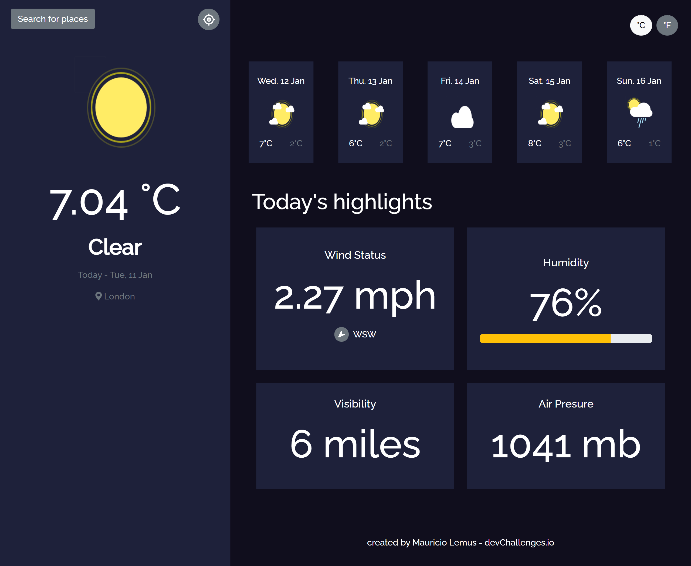

<!-- Please update value in the {}  -->

<h1 align="center">Weather App</h1>

<div align="center">
   Solution for a challenge from  <a href="http://devchallenges.io" target="_blank">Devchallenges.io</a>.
</div>

<div align="center">
  <h3>
    <a href="https://weather-app-three-blush.vercel.app/">
      Demo
    </a>
    <span> | </span>
    <a href="https://devchallenges.io/challenges/mM1UIenRhK808W8qmLWv">
      Challenge
    </a>
  </h3>
</div>

<!-- TABLE OF CONTENTS -->

## Table of Contents

- [Overview](#overview)
  - [Built With](#built-with)
- [Features](#features)
- [How to use](#how-to-use)
- [Contact](#contact)
- [Acknowledgements](#acknowledgements)

<!-- OVERVIEW -->

## Overview



The app will be loaded with the default city information (London) and will display today's highlights with the forecast for the next few days. You can select your current city or any other, you can also switch between Celsius and Fahrenheit.

### Built With

<!-- This section should list any major frameworks that you built your project using. Here are a few examples.-->

- [React](https://reactjs.org/)
- [React Bootstrap](https://react-bootstrap.github.io//)
- [Bootstrap](https://getbootstrap.com/)
- [Sass](https://sass-lang.com/)


## Features

<!-- List the features of your application or follow the template. Don't share the figma file here :) -->

This application/site was created as a submission to a [DevChallenges](https://devchallenges.io/challenges) challenge. The [challenge](https://devchallenges.io/challenges/mM1UIenRhK808W8qmLWv) was to build an application to complete the given user stories.

- [x] User story: I can see city weather as default, preferably my current location

- [x] User story: I can search for city
- [x] User story: I can see weather of today and the next 5 days
- [x] User story: I can see the date and location of the weather
- [x] User story: I can see according to image for each type of weather
- [x] User story: I can see the min and max degree each day
- [x] User story: I can see wind status and wind direction
- [x] User story: I can see humidity percentage
- [x] User story: I can see a visibility indicator
- [x] User story: I can see the air pressure number
- [x] User story(optional): I can request my current location weather
- [x] User story(optional): I can convert temperature in Celcius to Fahrenheit and vice versa

## How To Use

<!-- Example: -->

To clone and run this application, you'll need [Git](https://git-scm.com) and [Node.js](https://nodejs.org/en/download/) (which comes with [npm](http://npmjs.com)) installed on your computer. From your command line:

```bash
# Clone this repository
$ git clone https://github.com/your-user-name/your-project-name

# Install dependencies
$ npm install

# Run the app
$ npm start
```

## Acknowledgements

<!-- This section should list any articles or add-ons/plugins that helps you to complete the project. This is optional but it will help you in the future. For example: -->

- [cors-anywhere](https://github.com/Rob--W/cors-anywhere/)
- [How customize Bootstrap 5 with Sass](https://getbootstrap.com/docs/5.0/customize/sass/)


## Contact

- GitHub [@JMauricio22](https://github.com/JMauricio22)